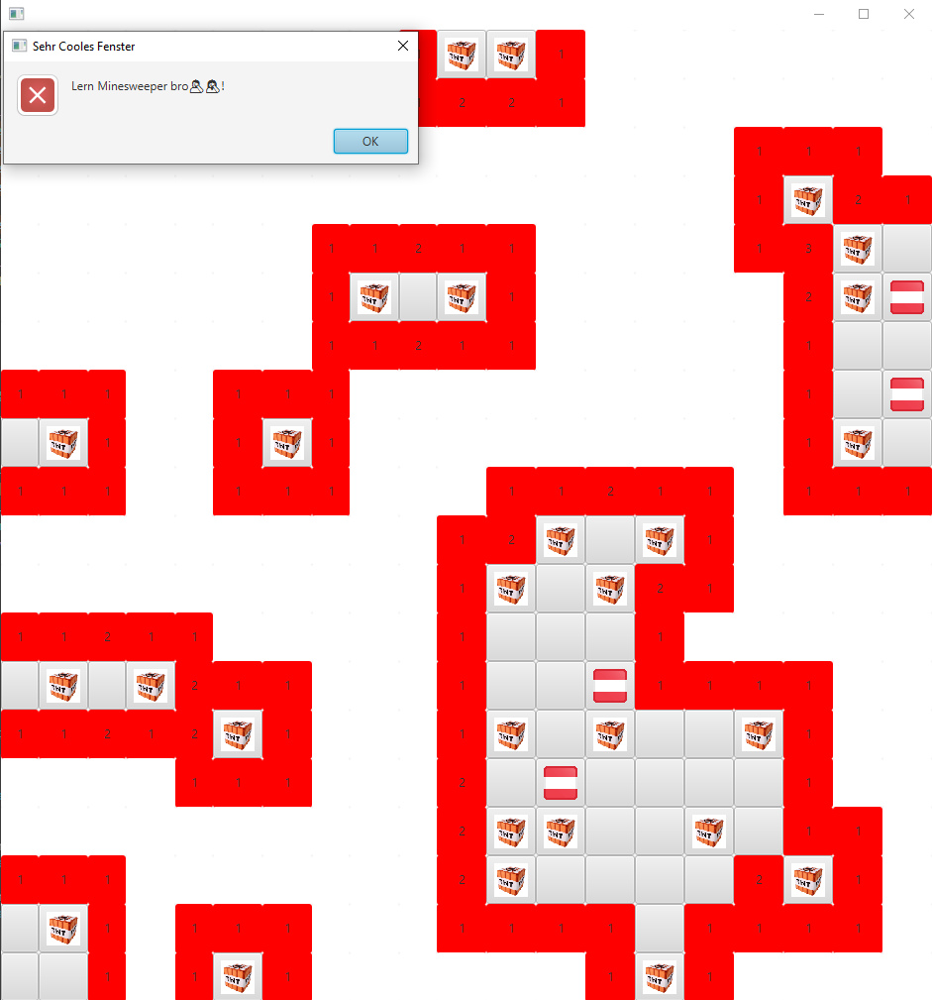

# This is my Minesweeper interpretation in openJFX (javaFX)

>note: Not optimized code...I did not put all my effort into it so this repository does not reflect my coding skills

# Features

- Bomb count (number showing how many bombs are in a 3x3 radius)
- A "Win-Screen" if all bombs were flagged
- A "Lost-Screen" if a bomb was pressed
- An barebone interface which gives the minimum amount of information needed
- code: MVC, usage of Observer (deprecated after Java 9)

# Controlls
Button  | Function
------------- | -------------
 Left-Click  | Open 
Right-Click  | Flag

# Usage
## Tested Versions
|                | JRE 11 (Maven) |
|           ---: |   :---: |
| V1  | ✅   |

>i´ll propably wont test any more but i wanted to include it anyways

## OpenJFX 11
Link -> [OpenJFX](https://openjfx.io)

## Images used:

 
[Link](https://cdn.countryflags.com/thumbs/austria/flag-button-square-250.png) 
 
[Link](https://www.thedota2store.com/media/catalog/product/cache/42ff4984ffd52745e8753c22ee11bc83/m/i/minecraft-tnt-plush-toys-bomb-square-stuffed-toys_2.jpg)

